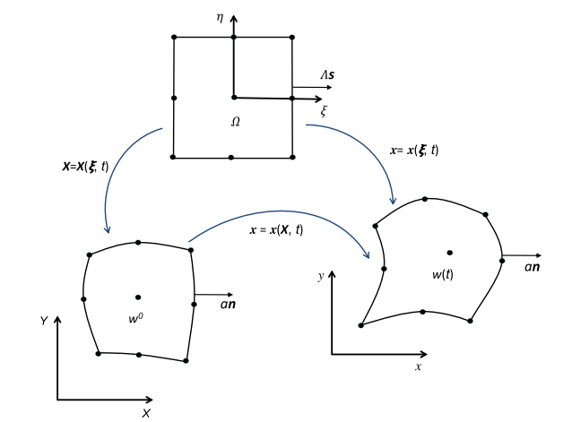

---
html:
    toc: true
---

# A high-order Lagrangian DG hydrodynamic method for quadratic cells using a subcell mesh stablization scheme

Xiaodong Liu, Nathaniel R. Morgan, Donald E. Burton

## 算法

### 控制方程

$$
\begin{align}
\frac{dm}{dt} & = 0\\
\rho \frac{d\nu}{dt} & = \nabla \cdot \textbf{u}\\
\rho \frac{d\textbf{u}}{dt} & = \nabla \cdot \sigma\\
\rho \frac{d\tau}{dt} & = \nabla \cdot (\sigma \textbf{u})
\end{align}
$$
其中$\sigma = -p \textbf{I}$是应力张量，$\tau = e + k$是质量总能，$e$,$k$分别是质量内能和质量动能。不妨将上式写成：
$$
\begin{equation}
\rho \frac{d\mathbb{U}}{dt} = \nabla \cdot \mathbb{H}
\end{equation}
$$

质点运动方程为
$$
\begin{equation}
\frac{dx}{dt} = \textbf{u}
\end{equation}
$$

### 网格映射

四边形网格使用九点插值：
$$
\begin{equation}
\textbf{x} (\xi,t) = \sum_{p} x_p(t) b_p(\xi)
\end{equation}
$$

### 离散

选取Taylor基函数$\mathbf{\Psi}$。假设$(\xi_{cm},\eta_{cm})$仍是单元的质心，任意变量$\mathbb{U}$可表示为：
$$
\begin{equation}
\mathbb{U}(\xi,t) = \mathbf{\Psi}(\xi) \cdot \mathbb{U}^k(t)
\end{equation}
$$
其中
$$
\begin{equation}
\mathbb{U}^k = (\mathbb{U}_{cm}, \frac{\partial \mathbb{U}}{\partial \xi}\big|_{cm},\frac{\partial \mathbb{U}}{\partial \eta}\big|_{cm}, \frac{\partial^2 \mathbb{U}}{\partial \xi^2}\big|_{cm},\frac{\partial^2 \mathbb{U}}{\partial \xi \partial \eta}\big|_{cm}, \frac{\partial^2 \mathbb{U}}{\partial \eta^2}\big|_{cm})
\end{equation}
$$

$\mathbb{U}_{cm} = \overline{\mathbb{U}}$是$\mathbb{U}$在单元上的质量平均，于是Taylor基函数可以定义成：
$$
\begin{equation}
\begin{align*}
\Psi_1 & = 1\\
\Psi_2 & = \xi - \xi_{cm}\\
\Psi_3 & = \eta - \eta_{cm}\\
\Psi_4 & = \frac{(\xi-\xi_{cm})^2}{2} - \frac{1}{m} \int_{\omega(t)} \rho \frac{(\xi-\xi_{cm})^2}{2} d\omega\\
\Psi_5 & = \frac{(\eta-\eta_{cm})^2}{2}  - \frac{1}{m} \int_{\omega(t)} \rho \frac{(\eta-\eta_{cm})^2}{2} d\omega\\
\Psi_6 & = (\xi-\xi_{cm})(\eta - \eta_{cm}) - \frac{1}{m} \int_{\omega(t)} \rho (\xi-\xi_{cm})(\eta - \eta_{cm}) d\omega\\
\end{align*}
\end{equation}
$$

### DG

在方程$\rho \frac{d \mathbb{U}}{dt} = \nabla \cdot \mathbb{H}$两边同时乘以基函数$\Psi_m$然后积分，利用格林公式得到：
$$
\begin{equation}
\begin{align*}
\sum_n M_{mn} \frac{d\mathbb{U}_n}{dt} & = \int_{\omega(t)} \nabla \cdot (\Psi_m \mathbb{H}) d\omega - \int_{\omega(t)} \mathbb{H} \cdot (\nabla \mathbb{H}) d\omega\\
& = \oint_{\omega(t)} \Psi_m \mathbb{H} \cdot \textbf{n} da - \int_{\Omega} \mathbb{H} \cdot (J^{-T}\nabla_{\xi} \Psi_m) |J| d\Omega
\end{align*}
\end{equation}
$$
其中$M = (M_{mn})$是质量矩阵，和时间无关。

面积上的积分在参考单元进行，边界上的积分在物理空间进行，但是边界积分是通过节点处插值实现的，计算时只需要节点处的点值。

时间积分使用RK3：假设方程为$M \nu = \mathbb{R}$，则RK3为：
$$
\begin{equation}
\begin{align*}
& \nu^{s1} = \nu^n + \Delta t (M^{-1})^n \mathbb{R}^n\\
& \nu^{s2} = \frac{3}{4} \nu^n + \frac{1}{4} \nu^{s1} + \frac{\Delta t}{4}(M^{-1})^{s1} \mathbb{R}^{s1}\\
& \nu^{n+1} = \frac{1}{3} \nu^n + \frac{2}{3} \nu^{s2} + \frac{2 \Delta t}{3} (M^{-1})^{s2} \mathbb{R}^{s2}
\end{align*}
\end{equation}
$$

## RS

定义corner force
$$
\begin{equation}
\textbf{F}_i^* = a_i \sigma^*_c \textbf{n}_i = a_i \sigma_c \textbf{n}_i + \mu_i a_i (\textbf{u}_V^* - \textbf{u}_c)
\end{equation}
$$
其中$a_i$代表某种边长，$\textbf{n}_i$是（物理空间中）单位外法向量，下标$c$代表corner，是在节点处由中心量重构的值，$\mu_i$是阻抗，$\textbf{u}_V^*$是节点速度。

$$
\begin{equation}
\mu_i = \rho_z (c_z + \beta \frac{\gamma + 1}{2} (\textbf{u}_V^* - \textbf{u}_c) \cdot \textbf{n}_i)
\end{equation}
$$
下标$z$代表zone，是单元的中心值。

### SMS

本文提出了子子网格划分SMS：将原本的九点插值的四边形网格划分为四个子网格，用子网格中的压力$\tilde{p}_c$去代替原本RS中的压力。子网格划分如下：

*本文对子网格划分的认识是这样的：对每个子网格去计算一个平均密度 $\overline{\rho}_s$，用这个密度和用大网格中心值计算的子网格平均密度 $\overline{\rho}_{\nu s}$的差异来评价子网格变形，然后通过这个差异修改RS中用到的压力值。*

$\overline{\rho}_s$的计算为：
$$
\begin{equation}
\overline{\rho}_s = \frac{m_s}{|\omega_s(t)|} = \frac{\int_{\Omega} (\rho^0 |J|^0)_s d\Omega}{\int_{\Omega}(|J|)_s d\Omega}
\end{equation}
$$
上面这个方法就是从强质量守恒得到的，然后再用中心值重构的密度计算子网格平均密度：
$$
\begin{equation}
\overline{\rho}_{\nu s} = \frac{\int_{\Omega} (\frac{1}{\nu} |J|)_s d\Omega}{|\omega_s(t)|}
\end{equation}
$$

然后将节点的密度$\rho_c$改为：
$$
\begin{equation}
\begin{align*}
\tilde{\rho}_c & = \rho_c + \chi \delta \rho_s\\
\delta \rho_s & = \overline{\rho}_s - \overline{\rho}_{\nu s}
\end{align*}
\end{equation}
$$
其中$\chi$是一个特征函数，没有特殊说明就取为1。于是RS中的$p_c$就改成$\tilde{p}_c = EOS(\tilde{\rho}_c,e)$，RS中其余部分不变。

### DG的Gauss积分

之前分析得到：
$$
\begin{equation}
\sum_n M_{mn} \frac{d\mathbb{U}_n}{dt}
= \oint_{\omega(t)} \Psi_m \mathbb{H} \cdot \textbf{n} da - \int_{\Omega} \mathbb{H} \cdot (J^{-T}\nabla_{\xi} \Psi_m) |J| d\Omega
\end{equation}
$$

对于体积分（$M_{mn}$和右手端最后一项），直接用Gauss求积公式。现在主要关注边界的积分。

#### Simpson求积公式算边界积分

以比容$\nu$的积分为例：
$$
\begin{equation}
\sum_n M_{mn} \frac{d\nu_n}{dt} = (\sum_{i\in \omega(t)} \Psi_{m_i} a_i \textbf{n}_i \cdot \textbf{u}_V^* ) - [\cdots]
\end{equation}
$$
Simpson公式的系数被包含在$a_i$里。**上面的$i$还要包括划分中的虚网格边界：**

以边$V_3V_4$为例，这条边上的积分整个写出来是：
$$
\begin{equation}
(a_2 \textbf{n}_2)_{V_3} \cdot \textbf{u}_{V_3}^* + \sum_{i=1}^2 (a_i \textbf{n}_i)_{V_7^r} \cdot \textbf{u}_{V_7}^* + \sum_{i=1}^2 (a_i \textbf{n}_i)_{V_7^l} \cdot \textbf{u}_{V_7}^* + (a_1 \textbf{n}_1)_{V_4} \cdot \textbf{u}_{V_4}^*
\end{equation}
$$

> 实际上就是先在每个子网格上进行通量积分，然后再加在一起作为大网格的通量积分。中间一个点$V_9$因为在网格内部，认为网格内部没有间断所以绕着$V_9$的通量积分为0。

$a_i \textbf{n}_i$的计算：
同样以$V_3V_4$边为例，由于
$$
\int_{V_3V_4} d \textbf{s} = \int_{V_3V_4} \textbf{n} ds = \frac{1}{6} s_3 \textbf{n}_3 + \frac{4}{6} s_7 \textbf{n}_7 + \frac{1}{6} s_4 \textbf{n}_4
$$
其中$s_i$表示在点$V_i$处$|J|$的值。所以本文直接取：
$$
\begin{align*}
(a_2 \textbf{n}_2)_{V_3} & = \frac{1}{6} s_3 \textbf{n}_3\\
(a_1 \textbf{n}_1)_{V_4} & = \frac{1}{6} s_4 \textbf{n}_4\\
(a_1 \textbf{n}_1)_{V_7^r} & = (a_2 \textbf{n}_2)_{V_7^l} = \frac{2}{6} s_7 \textbf{n}_7
\end{align*}
$$

在虚拟边界上：
$$
(a_1 \textbf{n}_1)_{V_7^l} = -(a_2 \textbf{n}_2)_{V_7^r} = \zeta s_{7t} \textbf{n}_{7t}
$$
其中$s_{7t}$为边$V_9V_7$上$|J|$在点$V_7$的值，$\zeta$取成$\frac{4}{6}$

### 限制器

略

### 步骤
>
> + $t_0$时：
>   + 确定网格划分
>   + 计算质心
>   + 计算初值
>   + 计算质量矩阵
> + $t_n$时：
>   + RK stage i, i= 1,2,3：
>     + 计算节点速度$u_p^*$
>     + 更新所有几何量
>       + 节点坐标
>       + Jacobi矩阵
>       + 加权外法向量
>       + 子网格面积
>     + 计算DG的积分值，更新物理量

***

## 数值算例
